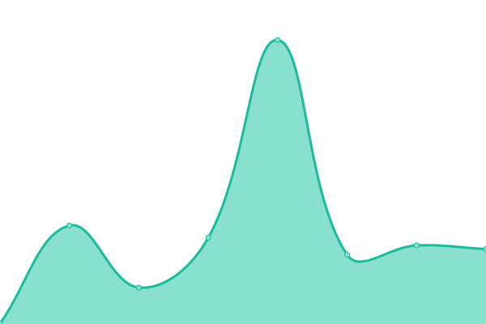
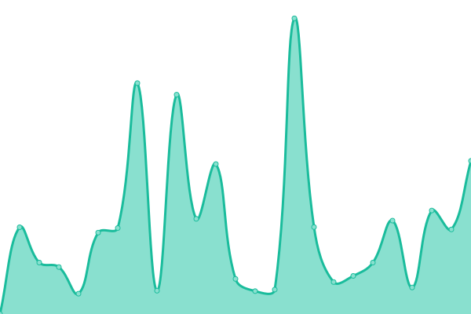

# [📈 Live Status](https://mossgrid.github.io/sentinel): <!--live status--> **🟧 Partial outage**

This repository contains the open-source uptime monitor and status page for [shadow wizard money gang](https://mossgrid.netlify.app/), powered by [Upptime](https://github.com/upptime/upptime).

With [Upptime](https://upptime.js.org), you can get your own unlimited and free uptime monitor and status page, powered entirely by a GitHub repository. We use [Issues](https://github.com/mossgrid/sentinel/issues) as incident reports, [Actions](https://github.com/mossgrid/sentinel/actions) as uptime monitors, and [Pages](https://mossgrid.github.io/sentinel) for the status page.

<!--start: status pages-->
<!-- This summary is generated by Upptime (https://github.com/upptime/upptime) -->
<!-- Do not edit this manually, your changes will be overwritten -->
<!-- prettier-ignore -->
| URL | Status | History | Response Time | Uptime |
| --- | ------ | ------- | ------------- | ------ |
|  [buymezobo](https://buymezobo.ng) | 🟩 Up | [buymezobo.yml](https://github.com/mossgrid/sentinel/commits/HEAD/history/buymezobo.yml) | 

 682ms
     
 | 

<a href="https://mossgrid.github.io/sentinel/history/buymezobo">100.00%</a>
    

|  [buymezobo dev](https://buymezobo.vercel.app/) | 🟩 Up | [buymezobo-dev.yml](https://github.com/mossgrid/sentinel/commits/HEAD/history/buymezobo-dev.yml) | 

 144ms
     
 | 

<a href="https://mossgrid.github.io/sentinel/history/buymezobo-dev">100.00%</a>
    

|  [api.buymezobo](https://core.buymezobo.ng/api/healthcheck) | 🟥 Down | [api-buymezobo.yml](https://github.com/mossgrid/sentinel/commits/HEAD/history/api-buymezobo.yml) | 

 2726ms
     
 | 

<a href="https://mossgrid.github.io/sentinel/history/api-buymezobo">96.60%</a>
    

<!--end: status pages-->

[**Visit our status website →**](https://mossgrid.github.io/sentinel)

## 📄 License

- Powered by: [Upptime](https://github.com/upptime/upptime)
- Code: [MIT](./LICENSE) © [Anand Chowdhary](https://anandchowdhary.com), supported by [Pabio](https://pabio.com)
- Data in the `./history` directory: [Open Database License](https://opendatacommons.org/licenses/odbl/1-0/)
